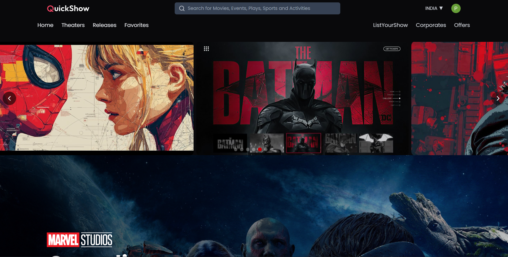
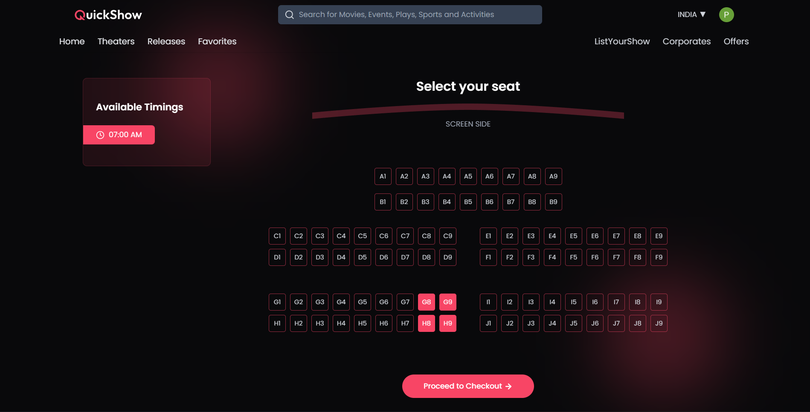
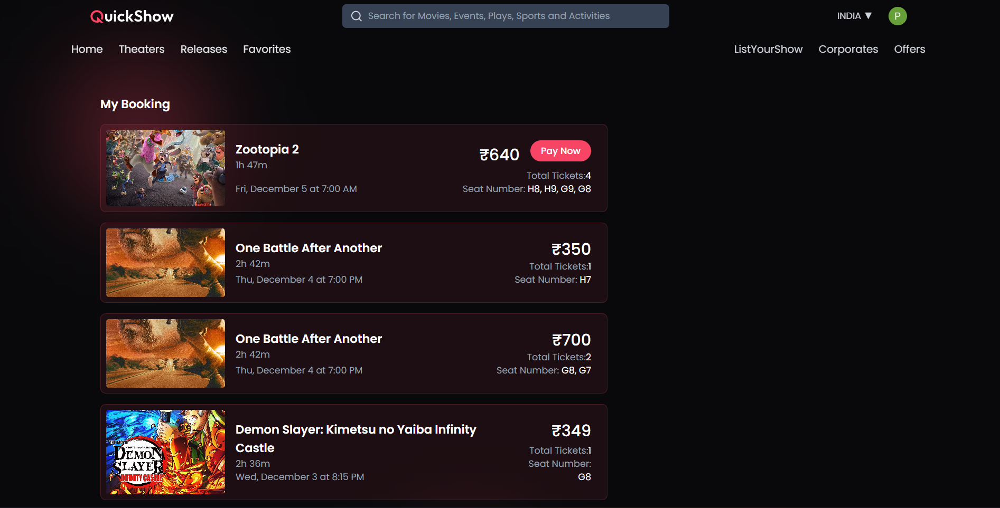
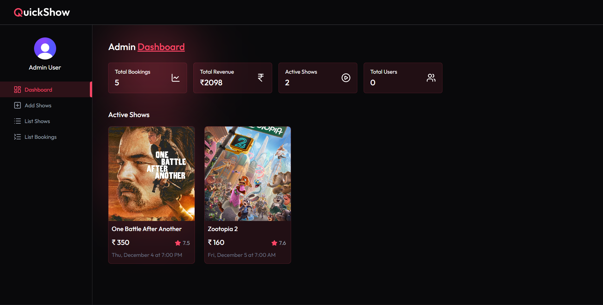
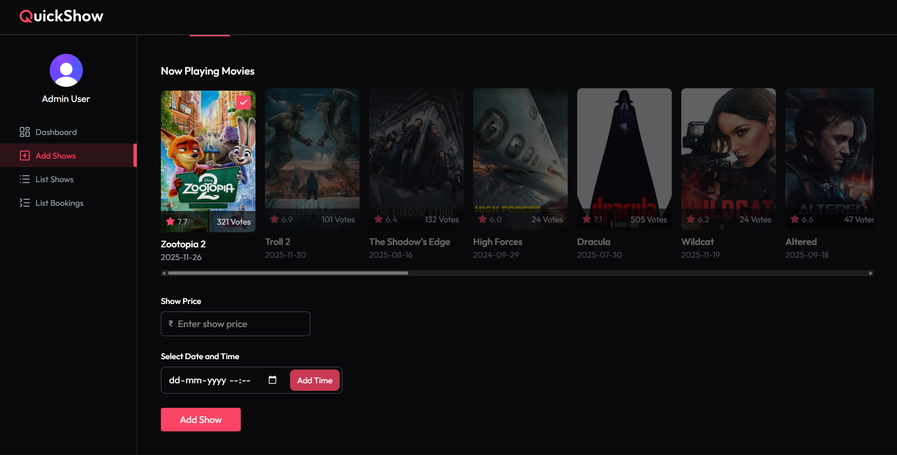
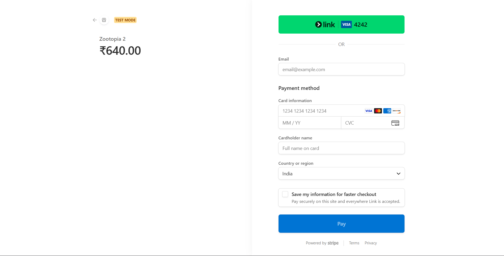

# 🎬 Book-My-Movie  
---

A Full-Stack Movie Ticket Booking Application.

**Book-My-Movie** is a full-stack **React + Node.js** movie ticket booking application inspired by **BookMyShow**.


| 🏆 **Book-My-Movie** | 🛠️ **Tech Stack** |
|----------------------|--------------------|
| It includes: <br>• User authentication with Clerk <br>• Movie discovery using the **TMDb API** <br>• Realistic seat selection system <br>• **Stripe** payment integration <br>• Booking history management <br>• Fully functional **Admin Dashboard** for managing movies, pricing, and shows <br>• Fully responsive UI built with **React & Tailwind CSS** <br><br> **Built collaboratively in 2 months by:** <br>• **Rounak** — Frontend (React UI, Tailwind CSS) <br>• **Pradipta** — Backend (Express API, MongoDB, Inngest, Stripe) | **Frontend**:<br>• React <br>• React Router <br>• Context API <br>• CSS / Tailwind CSS <br>• Clerk Authentication <br>• Stripe JS <br><br> **Backend**:<br>• Node.js <br>• Express <br>• MongoDB + Mongoose <br>• Inngest <br>• Stripe Webhooks <br>• TMDb API |

---

| 🌐 **Live Site** | 🚀 **Launch App** | 📸 **Preview** |
|:----------------:|:----------------:|:--------------:|
| Visit the deployed version of the project here | [](https://moviebooking-fawn.vercel.app/) | Hang tight! images of the project are below — just scroll and enjoy as you read. |


# ⭐ Key Features (Explained in Detail)

## This section explains the whole project in a simple, beginner-friendly way so any new learner can understand how each part works.
- *Screenshots below, just hang tight and scroll down as you read...*
---
## 🎬 1. Movie Data Fetched Dynamically From TMDb API

Instead of manually storing posters, images, descriptions, and ratings, casts, we use the **TMDb API** to fetch real-time movie data.

### How it works:
- The React frontend asks the backend for movie data  
- The backend sends a request to TMDb  
- TMDb returns:
  - Poster image  
  - Title & overview  
  - Genres  
  - Ratings  
  - Release date  

This keeps our movie list **instantly updated**—just like modern OTT/booking apps.

---

## 🔐 2. Authentication & Role Management With Clerk

We implemented **Clerk** to handle all authentication securely and effortlessly.

### Clerk provides:
- Sign-up / Sign-in  
- Google OAuth  
- Secure JWT sessions  
- User profile & metadata  

Using Clerk metadata, we identify:

- **Normal Users** → browse movies, select seats, make payments, view bookings  
- **Admins** → access the Admin Dashboard to control movie listings  

This mirrors the access control used in real production applications.

---

## 🎟️ 3. Realistic Seat Layout and Booking Logic

We built a cinema-style seat layout system that supports:

- **Grey** → Available  
- **Green** → Selected  
- **Red** → Already booked  

### Booking process:
1. User selects seats  
2. Seats get **temporarily locked**  
3. Backend verifies availability  
4. If payment succeeds → seats become **permanently booked**  
5. If payment fails or tab closed → seats **auto-unlock**  

This is supported by **Inngest**, preventing double bookings and handling timeouts or abandoned bookings.

---

## 💳 4. Stripe Payment Integration (Test Mode)

Users can book their tickets through **Stripe Checkout** using test card details.

### Payment flow:
1. User selects seats  
2. Backend creates a Stripe Checkout session  
3. User pays → Stripe sends webhook  
4. Inngest handles the event  
5. Backend:
   - Confirms booking  
   - Marks seats as booked  
   - Stores booking history  

This setup fully simulates a real payment environment.

---

## 🧑‍💼 5. Admin Dashboard (Movie & Show Management)

Admins can:

- Add new movies  
- Set pricing for each movie  
- Manage showtimes  
- Activate/deactivate movies  
- View booking statistics  

Admin actions are stored in **MongoDB** and update instantly on the client side.

---

## ⚙️ 6. Backend API With Express, MongoDB & Mongoose

A robust backend built using **Node.js, Express, and MongoDB**.

### Backend includes:
- **Models** → Movie, Show, Booking, User  
- **Controllers** → core business logic  
- **Routes** → REST API endpoints  
- **Middlewares**  
  - Authentication  
  - Error handling  
  - Request validation  

All database operations use **Mongoose**, ensuring data integrity and structure.

---

## 🚀 7. Event-Driven Backend With Inngest

We use **Inngest** to handle background tasks and events.

### Inngest handles:
- Stripe webhook events  
- Seat locking timers  
- Timed unlocks  
- Booking confirmation  
- Consistency checks  

This ensures:
- No race conditions  
- No overlapping bookings  
- Smooth payment → booking flow  

It makes the backend scalable and resilient.

---

## 🧠 8. Rich Frontend Architecture With React Context

We use multiple **React Contexts** to manage state:

- **Auth Context** → user identity (via Clerk)  
- **Movie Context** → movie caching and API calls  
- **Booking Context** → seats, pricing, checkout flow  
- **Admin Context** → dashboard state  

This results in cleaner components and a smoother user experience.

---

<p align="center">

# 🛠️ Tech Stack

| **Frontend** | **Backend** |
|:------------:|:-----------:|
| React | Node.js |
| React Router | Express |
| Context API | MongoDB + Mongoose |
| CSS | Inngest |
| Clerk Authentication | Stripe Webhooks |
| Stripe JS | TMDb API |

</p>

---
---
| Home Page | Trailer Section |
|----------|------------------|
|  |  |

| Movie Details | Seat Layout |
|--------------|-------------|
|  |  |

| Booking Layout | Admin Dashboard |
|----------------|------------------|
|  |  |

| Admin Add Shows | Stripe Checkout |
|------------------|-----------------|
|  |  |


# 🚀 Getting Started
## 1️⃣ Clone the Repository
```bash
 take from the repo link
git clone https://github.com/rou-nak-cloud/book-my-movie.git

cd client
npm install

cd ../server
npm install
```

## Create Environment variables for server:
```
 in .env file ; all will be your secrets..
- MONGO_URI=
- TMDB_API_KEY=
- CLERK_SECRET_KEY=
- STRIPE_SECRET_KEY=
- STRIPE_WEBHOOK_SECRET=
- INNGEST_EVENT_KEY=
- PORT=5000
```
  ## Envire=onment variables for client side:
  ```
- VITE_CLERK_PUBLISHABLE_KEY=
- VITE_API_URL=http://localhost:5000
  ```

  ```
  cd server
  npm run dev

  cd client
  npm start
  
  ```
 
## 📜 License  
This project is **open-source** and completely **free to use**.

---

## ⭐ Show Your Support  
If you found this project helpful or inspiring, please consider giving it a ⭐ on GitHub!

### 👨‍💻 Contributors  
- **Rounak**   
  🔗 https://github.com/rou-nak-cloud  

- **Pradipta**  
  🔗 https://github.com/mePradipta30  

Your support motivates us to build more awesome projects! 🚀

